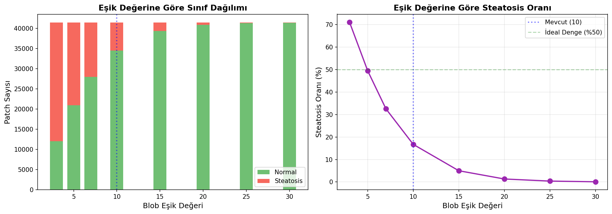
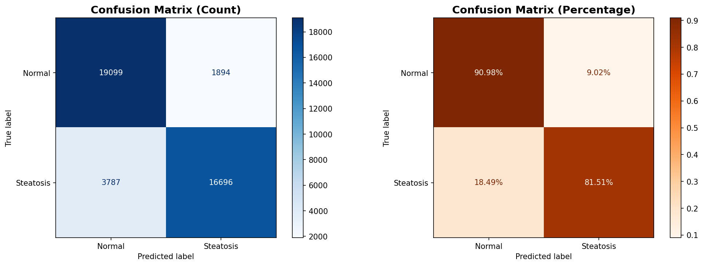
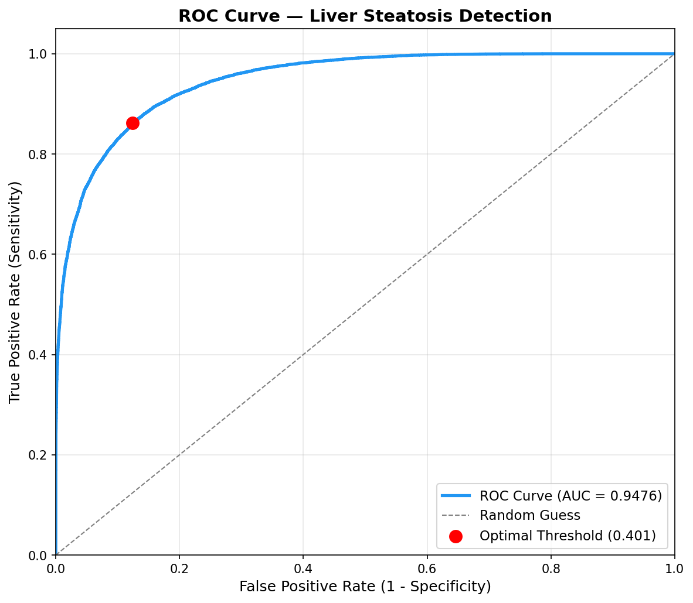
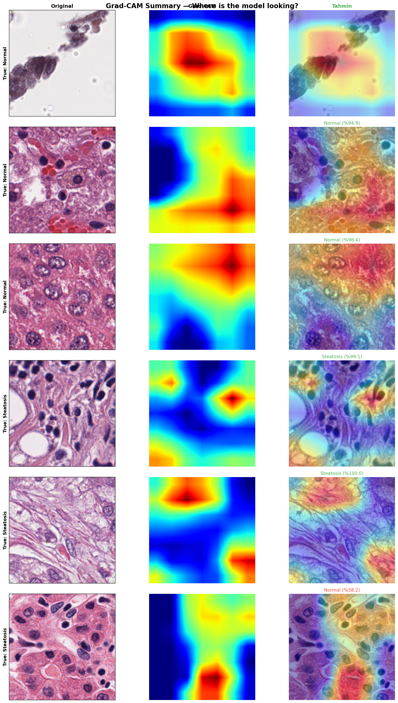
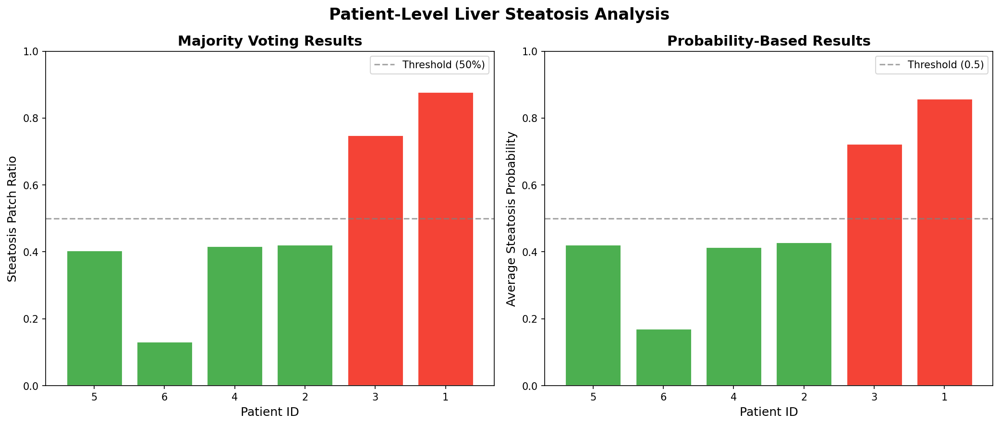

# Detection of Liver Steatosis from Microscopy Images

An end-to-end deep learning pipeline for the automated detection of **liver steatosis (hepatic steatosis)** from whole-slide histopathology (WSI) images.

> Istanbul Technical University - Faculty of Computer and Informatics
> Department of Computer Engineering - Graduation Project (June 2026)
>
> **Student:** İsmet Umuralp Şen
> **Advisor:** Prof. Dr. Behçet Uğur Töreyin

---

## Project Overview

Hepatic steatosis, defined as the excessive accumulation of lipid (fat) droplets within hepatocytes, is the primary histopathological feature of non-alcoholic fatty liver disease (NAFLD). In current clinical practice, steatosis grading is performed by pathologists examining H&E-stained biopsy slides under a microscope; this process is time-consuming and subject to inter-observer variability.

This project presents an automated classification system that processes raw whole-slide images in SVS format and distinguishes steatotic from normal liver tissue **without any manual annotation**. The system is designed to run entirely on CPU hardware.

## Pipeline

The system consists of five integrated stages:

| Stage | File | Description |
|-------|------|-------------|
| 1. Patch Extraction | `patch.py` | WSIs are tiled into 256x256 patches using OpenSlide; a tissue detection filter discards background. |
| 2. Automated Labeling | `label.py` | Patches are labeled via morphological blob detection (>=5 blobs -> steatosis). |
| 3. Model Training | `train.py` | An ImageNet-pretrained ResNet18 is fine-tuned with patient-level 3-fold GroupKFold cross-validation. |
| 4. Evaluation | `evaluate.py` | Confusion matrix, ROC/AUC and medical metrics (sensitivity, specificity, PPV, NPV, F1). |
| 5. Interpretability | `gradcam.py` | Grad-CAM heatmaps visualize the regions the model focuses on. |

### Helper Scripts

| File | Description |
|------|-------------|
| `validate_labels.py` | Ablation study for the blob threshold (compares thresholds 3, 5, 7, 10, ...). |
| `patient_level_prediction.py` | Aggregates patch predictions to the patient level via majority voting. |
| `test_model.py` | Quick prediction on a single image or folder. |
| `visualize_samples.py` | Visualizes sample patches from the dataset. |

## Folder Structure

```
.
├── patch.py                      # 1. Patch extraction (WSI -> patch)
├── label.py                      # 2. Automated labeling (blob detection)
├── train.py                      # 3. Model training
├── evaluate.py                   # 4. Comprehensive evaluation
├── gradcam.py                    # 5. Grad-CAM visualization
├── validate_labels.py            # Threshold ablation study
├── patient_level_prediction.py   # Patient-level prediction
├── test_model.py                 # Single prediction
├── visualize_samples.py          # Dataset visualization
├── requirements.txt
├── results/                      # Generated metrics, plots and logs
│   ├── evaluation/               # Confusion matrix, ROC, metrics
│   ├── gradcam/                  # Grad-CAM heatmaps
│   ├── label_analysis/           # Threshold ablation plots
│   └── patient_level/            # Patient-level results
├── data/                         # (not tracked) raw .svs files
└── dataset/                      # (not tracked) extracted/labeled patches
    ├── patches/<patient_id>/
    └── train/{normal,steatosis}/
```

> Note: `data/`, `dataset/` and the trained model weights (`*.pth`) are not tracked due to their size (see `.gitignore`).

## Installation

```bash
# Virtual environment (recommended)
python -m venv .venv
# Windows
.venv\Scripts\activate
# Linux / macOS
source .venv/bin/activate

pip install -r requirements.txt
```

**OpenSlide note:** `patch.py` requires the OpenSlide binary library installed on the system to read SVS files. On Windows it can be installed with `pip install openslide-bin`, on Linux with `apt-get install openslide-tools`. (Only needed for the patch extraction stage.)

## Usage

The pipeline is run sequentially:

```bash
# 1) Place raw .svs files into the data/ folder, then:
python patch.py

# 2) Automatically label the patches
python label.py

# (Optional) Threshold ablation analysis
python validate_labels.py

# 3) Train the model
python train.py

# 4) Evaluate the trained model
python evaluate.py

# 5) Generate Grad-CAM visualizations
python gradcam.py

# (Optional) Patient-level prediction
python patient_level_prediction.py
```

## Labeling Threshold Ablation

The blob count threshold for the automated labeling was selected via an ablation study over eight candidate values. A threshold of **5** yields the most balanced class distribution (~50% steatosis), minimizing reliance on class weighting alone.

<p align="center">
  
</p>

## Results

The best fold model (Fold 1) exceeded the interim report targets (F1 >= 0.80, AUC >= 0.85).

### Comprehensive Evaluation (Best model - Fold 1)

| Metric | Value |
|--------|-------|
| Accuracy | 86.30% |
| Sensitivity (Recall) | 0.8151 |
| Specificity | 0.9098 |
| PPV (Precision) | 0.8981 |
| NPV | 0.8345 |
| F1-Score | 0.8546 |
| AUC (ROC) | 0.9476 |

<p align="center">
  
  
</p>

### Cross-Validation (3 folds)

| Fold | Accuracy | Precision | Recall | F1 |
|------|----------|-----------|--------|----|
| Fold 1 | 88.30% | 0.851 | 0.934 | 0.891 |
| Fold 2 | 80.62% | 0.949 | 0.326 | 0.485 |
| Fold 3 | 81.00% | 0.872 | 0.800 | 0.835 |
| **Mean** | **83.30%** | **0.890** | **0.686** | **0.737 ± 0.175** |

> The low recall in Fold 2 stems from its validation patients having a disproportionately low steatosis density. Folds 1 and 3 individually satisfy the F1 >= 0.80 target.

### Grad-CAM Interpretability

Grad-CAM visualizations confirm that the model focuses on lipid vacuole-like morphological structures rather than background artifacts.

<p align="center">
  
</p>

### Patient-Level Aggregation

Patch-level predictions are aggregated to the patient level via majority voting and mean probability.

<p align="center">
  
</p>

All plots and metrics are available in the `results/` folder.

## Method Details

- **Architecture:** ResNet18 (ImageNet pretrained), final layer changed from 512 -> 2.
- **Input:** 224x224x3 RGB.
- **Loss:** Weighted Cross-Entropy (for class imbalance).
- **Sampling:** Balanced batches via WeightedRandomSampler.
- **Optimization:** Adam (lr = 1e-4), ReduceLROnPlateau (factor=0.5, patience=3).
- **Augmentation:** Horizontal/vertical flip, ±15° rotation, color jitter, affine translation.
- **Cross-validation:** Patient-level 3-fold GroupKFold (prevents data leakage).
- **Early stopping:** Training stops if there is no improvement for 3 epochs.

## License

This project is distributed under the MIT License. See the [LICENSE](LICENSE) file for details.
